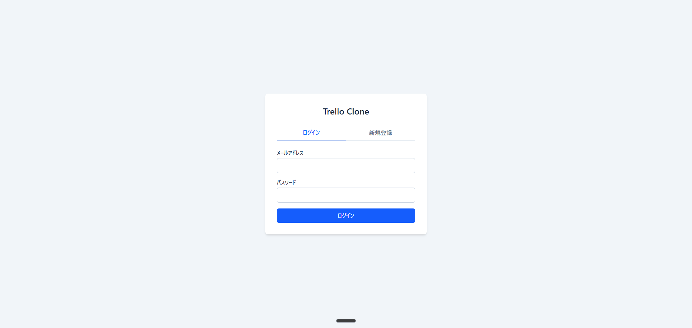
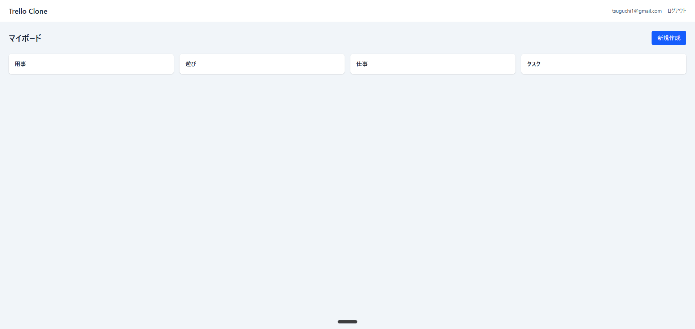
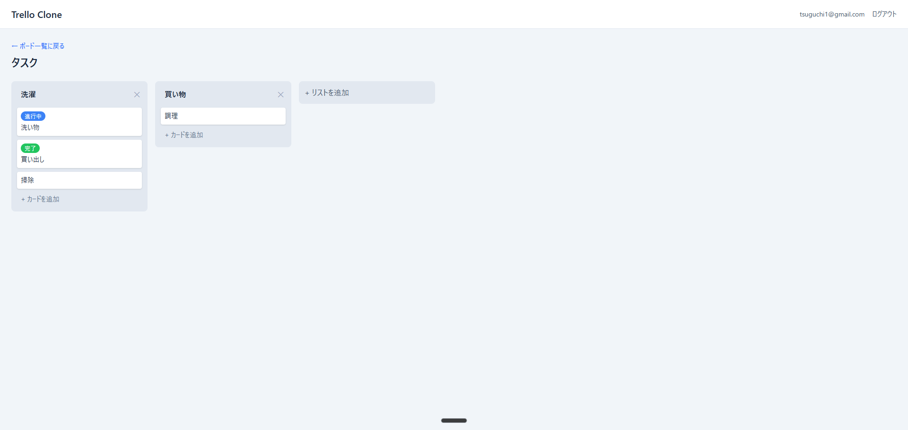
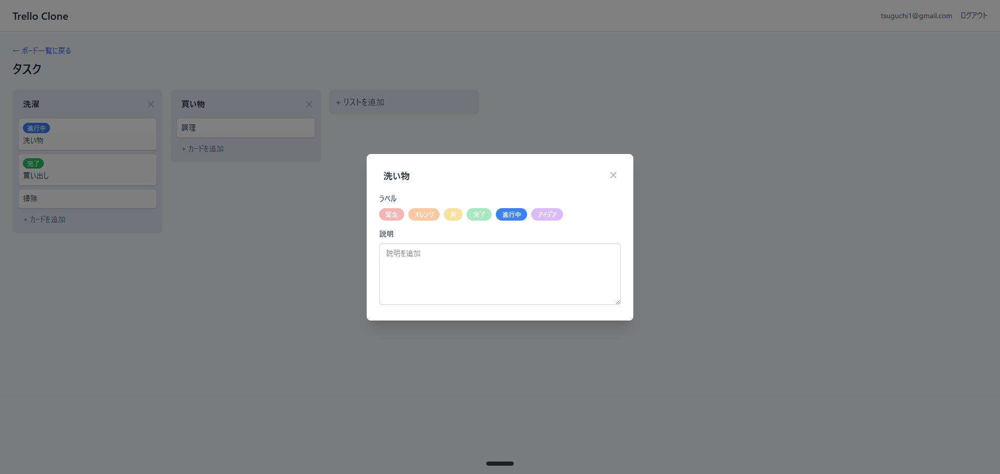

# Trello Clone

Trello風のカンバン方式タスク管理ツール。React + TypeScript + Firebase で作成。

**🌐 ライブデモ:** https://trello-27820.web.app

## スクリーンショット

### ログイン / 新規登録


### ボード一覧


### ボード詳細（リスト・カード）


### カード詳細モーダル


## 主な機能

- ユーザー登録・ログイン（メール/パスワード）
- 複数のボードを作成・削除
- リスト（カラム）の追加・削除・タイトル編集
- カード（タスク）の追加・編集・削除
- カードにラベル（色タグ）
- ドラッグ&ドロップでカードを移動・並び替え（同じリスト内 / 別のリストへ）
- クラウド自動保存（Firestore リアルタイム同期）
- レスポンシブ対応（PC・タブレット・スマホ）

## 技術スタック

| 領域 | 技術 |
|------|------|
| 言語 | TypeScript |
| フロントエンド | React 19 + Vite |
| スタイリング | Tailwind CSS v4 |
| 認証 | Firebase Authentication |
| データベース | Firebase Firestore |
| ルーティング | React Router |
| D&D | @dnd-kit |
| ホスティング | Firebase Hosting |

## セットアップ

```bash
# 依存パッケージのインストール
npm install

# .env.local を作成して Firebase の設定値を記入
cp .env.example .env.local
# → .env.local の各 VITE_FIREBASE_* に Firebase Console の値を入れる

# 開発サーバー起動
npm run dev
```

## 利用可能なコマンド

```bash
npm run dev      # 開発サーバー（http://localhost:5173）
npm run build    # 本番ビルド
npm run preview  # ビルド後のプレビュー
npm run lint     # ESLintチェック
```

## デプロイ

Firebase Hostingを使用。

```bash
npx firebase login       # 初回のみ
npm run build
npx firebase deploy      # ホスティング + Firestore ルールを同時デプロイ
```
